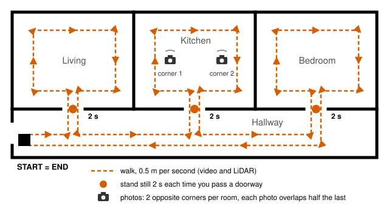

# Capture protocol (one page)

Pick one tier: **LiDAR** (iPhone Pro only), **Video** or **Photos** (any iPhone 15 or newer).

**Before you start:** turn on every light. Open every inside door fully. Close blinds where sun falls on the floor. Nobody else in the rooms. Use the 1x lens. Never film a mirror face-on.



## The walk (LiDAR and Video)

1. Start at the front door, phone at chest height.
2. Walk at 0.5 m per second (one slow step per second).
3. Go once around each room. Point at every wall, then tilt down to the floor and up to the ceiling.
4. Stand still **2 seconds in every doorway**, pointing into the next room.
5. A quarter turn takes at least 2 seconds.
6. End where you started, facing the same way.
7. 30 to 60 seconds per room; 4 minutes at most.

## A. LiDAR (iPhone Pro / Pro Max only)

1. Install **Stray Scanner** (free, App Store). Keep the default settings.
2. Tap record, do **the walk**, tap stop.
3. **Files** app → On My iPhone → Stray Scanner. Long-press the newest folder → **Compress** → Share → AirDrop to the laptop (Linux: Save to Files → a USB-C drive). Unzip it.
4. Check the folder holds `rgb.mp4`, `odometry.csv`, `depth/`, `confidence/`.
5. Run `uv run fp run ~/Downloads/<folder>`

## B. Video

1. **Camera** app → **Video** (not Cinematic, not Slo-mo). 1080p or 4K, 30 or 60 fps. HDR on or off.
2. Hold the phone **sideways** for the whole clip.
3. Do **the walk** in one clip.
4. Send the original file by AirDrop or cable (Linux: Save to Files → USB-C drive). Never by WhatsApp or email: they shrink it.
5. Run `uv run fp run ~/Downloads/IMG_1234.MOV`

## C. Photos

**In each room**, phone upright for every photo:

1. Stand near one end. Take a photo, turn on the spot so the next photo shows **half of the previous one**, take it. 3 photos.
2. Walk to the other end. 3 more the same way.
3. Tilt slightly down: floor in every photo.

**In each doorway:** face the next room, take **1 photo**. It joins the two rooms.

**At most 8 photos per room, doorway photos included.** With 3 or more doorways, take 2 photos per spot.

**Organise:** in Photos, one album per room, named after it (`kitchen`, `hall`). A doorway photo goes in the album of the room you stood in.

**Hand over:** on the laptop, make a folder with one subfolder per album:

```
my_home/kitchen/IMG_0001.HEIC
my_home/hall/IMG_0007.HEIC
```

- Mac: open an album → Select → select all → Share → AirDrop. Photos land in `Downloads`; move them into that room's subfolder. Repeat per album.
- Linux: plug a USB-C drive into the iPhone. Album → Select all → Share → Save to Files → the drive, one folder per album.

Then **copy** each doorway photo into the other room's subfolder too (copy the file; don't export it again). No photos loose in `my_home`. HEIC or JPEG both work.

Run `uv run fp run my_home`

---

Run commands in the `floorplan` folder ([README](README.md)). **Out:** `out/<name>/report.html` (open in a browser), `plan.svg`, `plan.json`. Every number has a range.
