# How it works: phone capture → 3D point cloud → floor plan

> **Note (2026-10-03).** This walk-through describes the LiDAR pipeline as first built, and its numbers
> (+15.2 cm width error, 11 wall lines) are from **before** the fixes. The stages are unchanged; the fix and
> current results are in [README.md](README.md) ("Weakest result"), [REVIEW.md](REVIEW.md) (status table)
> and [eval/results.md](eval/results.md). Photos and video now use the same stages, with depth from MapAnything.

This explains the idea, what is built today, and exactly how the 3D model (a point cloud) and
the floor plan are produced, one component at a time, so each one can be checked on its own.

- **Images** come from a real run on ARKitScenes scene `48018559`: an iPad Pro LiDAR scan of
  a narrow kitchen with a glimpse of the living room. Regenerate them for any capture with
  `uv run fp check all <capture_dir> --out <dir>`. ARKitScenes is © Apple, CC BY-NC-SA 4.0.
- **Diagrams** are Mermaid. GitHub renders them; in VS Code install
  *Markdown Preview Mermaid Support*. The ASCII sketches read fine as plain text.
- **"REVIEW #n"** refers to the numbered findings in [REVIEW.md](REVIEW.md).

---

## 1. The idea

The brief: turn a phone capture (photos, video, or LiDAR) into a dimensioned floor plan with
damage flags, and be honest about accuracy.

**Core design: every input type is converted into the same thing — a 3D point cloud with
surface directions — and one geometry engine turns that cloud into the plan.**
The output is therefore identical whatever the input; only the confidence changes.

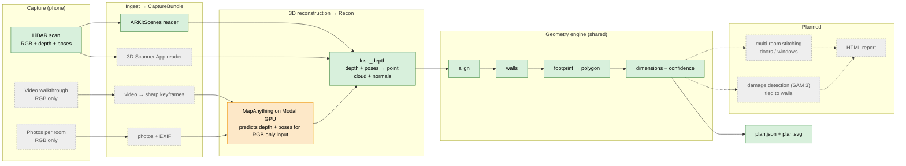
Green = working now · amber = blocked (Modal needs a card, [SETUP.md](SETUP.md) §2b) · grey = not built yet.

Why depth + poses is the common currency: a camera image alone has no distances. To place a
pixel in 3D you need **how far away it is** (depth) and **where the camera was** (pose).
- LiDAR phones measure both.
- For photos and video, MapAnything *predicts* both, then hands them to the same fusion code.

## 2. What is implemented today

| Part | File | Status |
|---|---|---|
| Data model (`Frame`, `CaptureBundle`, `Recon`) | [fp/bundle.py](fp/bundle.py) | ✅ |
| LiDAR reader (ARKitScenes format) + pose interpolation | [fp/ingest/arkitscenes.py](fp/ingest/arkitscenes.py) | ✅ |
| Depth fusion → coloured point cloud + normals | [fp/recon/lidar_fuse.py](fp/recon/lidar_fuse.py) | ✅ (smear issue, REVIEW #17) |
| Alignment: gravity, wall axes, floor, ceiling | [fp/geometry/align.py](fp/geometry/align.py) | ✅ (floor bug, REVIEW #7) |
| Walls, footprint, polygon, lengths, confidence (one room) | [fp/geometry/plan.py](fp/geometry/plan.py) | ✅ v0 |
| Plan drawing + debug image | [fp/report/svg.py](fp/report/svg.py), [fp/report/debug.py](fp/report/debug.py) | ✅ |
| Component checks (`fp check …`) | [fp/check.py](fp/check.py) | ✅ |
| Accuracy vs laser ground truth | [eval/arkit_gt.py](eval/arkit_gt.py) | ✅ (search-window bias, REVIEW #3) |
| Modal GPU smoke test | [fp/recon/hello_gpu.py](fp/recon/hello_gpu.py) | 🟧 blocked by billing |
| Frame-quality filter (blur, fast pans, duplicates) | — | ⬜ REVIEW #1 |
| 3D Scanner App reader (borrowed iPhone) | — | ⬜ needs a sample export |
| Photos/video → MapAnything | — | 🟧 blocked by billing |
| Multi-room stitching, doors, windows | — | ⬜ checkpoint 4 |
| Damage detection + concealed-damage rules | — | ⬜ checkpoint 5 |
| HTML report, capture protocol | — | ⬜ |

## 3. Key concepts

### Data that flows through the pipeline
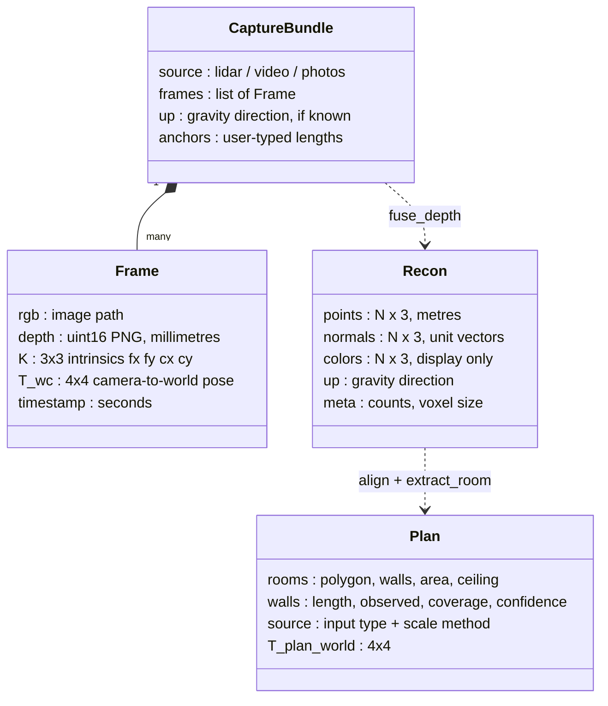

### Three coordinate frames (all in metres)
```
 CAMERA frame (one per frame)    WORLD frame (whole scan)          PLAN frame (ours)
        z  forward = depth             y  up (gravity)                 z  up, floor at z = 0
       /                               |                               |   y  along one set of walls
      o──── x  right                   o──── x                         |  /
      |                               /                                o──── x  along the other set
      y  down                        z
 origin: camera centre           origin: where the scan started    origin: scan origin, at floor level
```
- `T_wc` moves a point from camera to world.
- `T_plan_world` (from `align`) moves world to plan: it rotates so gravity is +z and walls run
  along x/y, then shifts so the floor is at z = 0. Every number in the plan is in this frame.

---

## 4. How the 3D point cloud is built (LiDAR path)

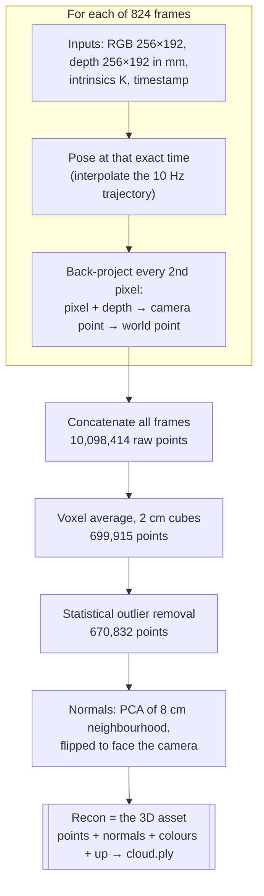
Check it: `uv run fp check fusion <capture>` replays these steps and writes the five figures below.

### 4.1 Inputs of one frame
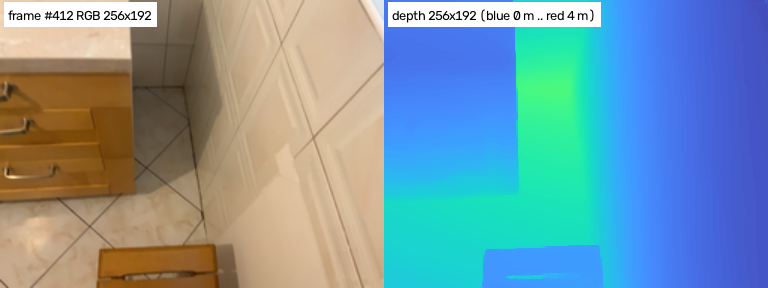

| Input | What it is | This scene |
|---|---|---|
| RGB | normal colour photo | 256×192, 60 frames/s (2,514 frames in 41 s) |
| Depth | distance along the camera's forward axis for each pixel, in mm | 256×192; this frame sees 0.33–1.63 m |
| K (intrinsics) | focal length `fx, fy` and image centre `cx, cy`, in pixels | fx = fy = 212.9, cx = 128.1, cy = 96.1 |
| Pose `T_wc` | rotation R (3×3) + position t of the camera in the world | from ARKit, 10 per second |

We use every 3rd frame (20 per second), so 838 candidates. 824 of them fall inside the
trajectory's time range and get a pose.

### 4.2 A pose for every frame (interpolation)
Poses arrive 10 times a second but frames 60 times a second. Each frame gets the pose *at
its own timestamp*: position is blended linearly and rotation is slerped between the two
nearest poses.
```
 poses:   P(10.00 s) ●───────────────────────────● P(10.10 s)
 frame:                    ▲ t = 10.03 s  →  a = 0.3
 pose(t) = position 0.7·p0 + 0.3·p1 ,  rotation 30 % of the way from R0 to R1
```
Why it matters: at 100°/s of rotation, a 50 ms pose error is 5°. At 3 m that puts a wall
point 26 cm off (3 m × tan 5°). Our first run used the nearest pose, and wall points spread over
tens of centimetres.

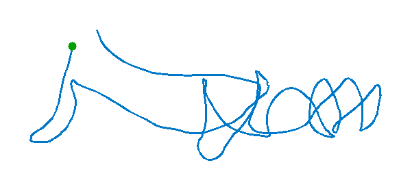

`fp check poses`: camera path from above (green dot = start, red = moving faster than 1 m/s).
This scan: 16.4 m walked, rotation p95 102°/s (fast, see REVIEW #1).

### 4.3 Back-projection: pixel + depth → 3D point
This is the core step. The camera is a pinhole, so by similar triangles a pixel's offset from
the image centre, divided by the focal length, equals the point's sideways offset divided by
its depth.
```
 top view of one ray                                         ● point on the wall
                                                         ╱   │
                                                     ╱       │  x = (u − cx) / fx · z
                                                 ╱           │
           image plane                       ╱               │
                │   pixel column u       ╱                   │
                │        ●           ╱                       │
                │   ╱                                        │
     camera ●───┼────────────────────────────────────────────┴───► forward axis
            ◄fx►│◄──────────── z = depth from the depth map ─►│
```
For each pixel `(u, v)` with depth `z` (metres):
```
 camera frame:  x = (u − cx) / fx · z      y = (v − cy) / fy · z      z = z
 world frame:   X = R · (x, y, z) + t      (R, t from the frame's pose)
```
Worked example, this scene's K: pixel (200, 96) at depth 2.000 m →
x = (200 − 128.1) / 212.9 × 2.0 = **0.675 m**, y = (96 − 96.1) / 212.9 × 2.0 ≈ **0.000 m**, z = **2.000 m**.
That's 67.5 cm right of the camera's forward axis, 2 m ahead. R and t then place it in the room.

Code: `frame_points()` in [fp/recon/lidar_fuse.py](fp/recon/lidar_fuse.py).
- Skips depth below 0.1 m (invalid) and above 4 m (LiDAR noise grows with range).
- Takes every 2nd pixel, so up to 128 × 96 = 12,288 points per frame.
- Rescales K if the depth map is smaller than the RGB image (true for iPhone exports).

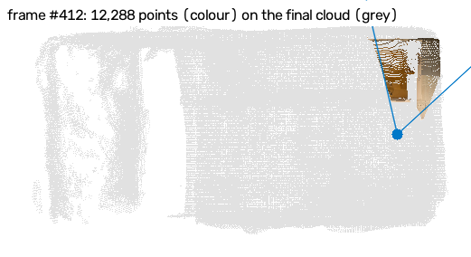

One frame's 12,288 points (in colour) dropped onto the final cloud (grey), seen from above.
The blue dot is the camera and the blue lines are the edges of its field of view. The points
must fall inside those lines; if they don't, the pose or K is wrong.

### 4.4 Accumulate all frames
Every frame's points are placed in the same world frame and simply concatenated. The room
fills in as the camera moves (blue = camera path so far; ceiling hidden so you can see inside):

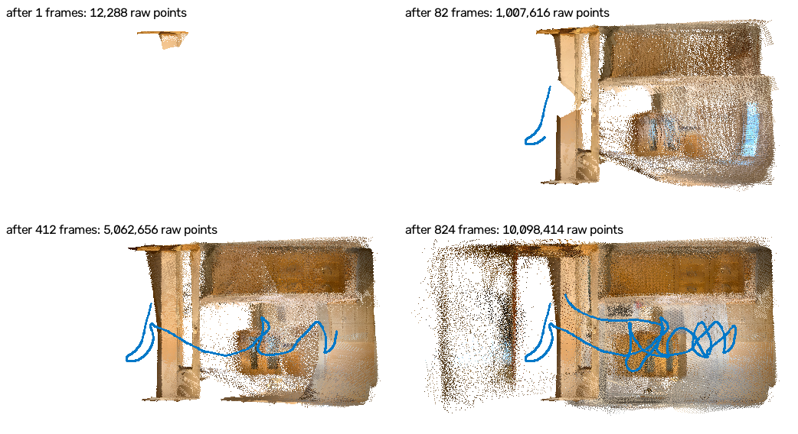

824 frames × 12,288 = **10,098,414 raw points**. Every surface is seen by many frames, so
it's covered many times over.

### 4.5 Clean-up: voxel averaging + outlier removal
```
 raw points (many, overlapping)      2 cm voxel grid                 1 averaged point per voxel
   · ·· ·  ·                          ┌──┬──┬──┐                      ┌──┬──┬──┐
  ·  ·· · ·  ·           ──►          │··│· │  │          ──►         │ •│• │  │
   ·· ·   ·· ·                        ├──┼──┼──┤                      ├──┼──┼──┤
    · ··  ·                           │ ·│··│· │                      │ •│ •│• │
                                      └──┴──┴──┘                      └──┴──┴──┘
```
- **Voxel average.** Space is cut into 2 cm cubes, and all points inside a cube become their
  average: 10.1 M → **699,915** points. This removes duplicates and random sensor noise.
- **Outlier removal.** For each point, take the mean distance to its 20 nearest neighbours;
  drop points whose distance is more than mean + 2 standard deviations: → **670,832** points
  (stray "flying" points at depth edges).

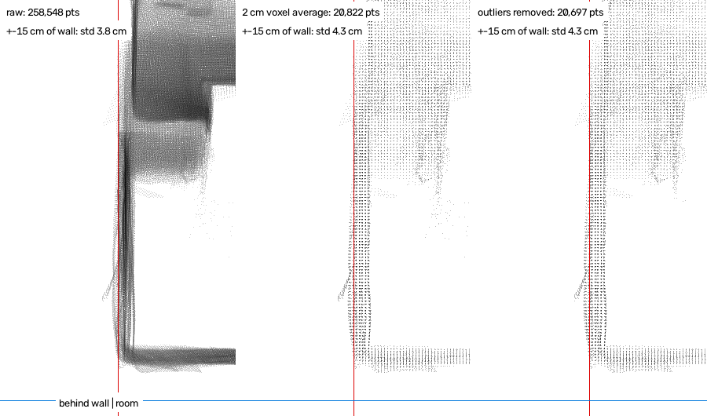

How to read this figure:
- It's a **side view of a 30 cm thick slice through the longest wall**.
- Horizontal axis = distance from the detected wall (red line; behind the wall on the left,
  room on the right). Vertical = height. Blue = detected floor (z = 0). Darker = more points.
- A perfect capture shows the wall as one thin vertical line and the floor as one thin
  horizontal line.

What this scene shows:
- The raw wall is **several parallel streaks**: the same wall seen from different frames
  doesn't line up. Averaging can't merge them. The spread within ±15 cm of the wall is about
  4 cm before and after; voxel averaging gives sparse stray points the same weight as dense
  ones, so it even grows slightly. → REVIEW #17.
- The real floor sits **~0.29 m above the blue line**, so the floor detector picked the wrong
  height. → REVIEW #7.
- The box at the top right is the upper kitchen cabinets.

### 4.6 Normals: which way each surface faces
```
 neighbours within 8 cm of a wall point      PCA finds the spread directions     normal = least-spread direction
   (wall seen edge-on, from above)
        ·  ·  ·  ·  ·  ·                      ◄────────────► large (along wall)          ▲ n
        ·  ·  ·  ●  ·  ·                      ↕ tiny (across the wall)             ──────●──────  wall
        ·  ·  ·  ·  ·  ·
 n and −n fit equally well → flip each normal to point toward the nearest camera (51 % flipped here)
```
Normals are what let later stages tell walls (normal horizontal) from floors and tables
(normal up) and from ceilings and cabinet undersides (normal down).

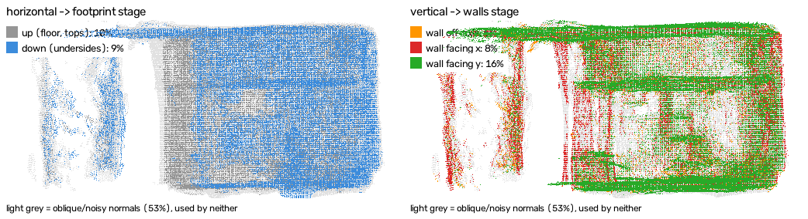

- **Left:** horizontal surfaces, which feed the footprint stage.
- **Right:** vertical surfaces facing x (red) or y (green), which feed the walls stage.
- **Light grey:** points whose normal is neither horizontal nor vertical. **53 % here**, used
  by neither stage. A smeared surface is a fuzzy blob, so its PCA normal is random.
  → REVIEW #18. A clean scan should be under ~25 %.

### 4.7 The result: the 3D asset
`Recon` = 670,832 points, each with position (m), normal and colour, plus the gravity
direction. It's saved as a point cloud:
```bash
uv run fp check cloud <capture>                          # writes out/<capture>/check/cloud.ply
uv run fp check view out/<capture>/check/cloud.ply       # drag = rotate, scroll = zoom, N = normals, +/- = point size
```
(MeshLab or CloudCompare also open `.ply`.)

**Why a point cloud and not a mesh:** a floor plan only needs *where the planes are*, which
comes straight from points + normals. A mesh (TSDF / Poisson) would only make the 3D view
prettier. Open3D 0.20's TSDF returns empty results on this Mac build, so meshing is left out
for now.

### 4.8 Photos and video (planned): same steps, predicted depth
A normal camera gives only RGB. MapAnything (on a Modal GPU) predicts, for each image:
- metric depth for every pixel (the depth map we lack);
- the camera pose and intrinsics (where we lack ARKit).

It fills `Frame.depth`, `Frame.T_wc` and `Frame.K`, and from §4.3 onward the code is the same.
Predicted depth is less accurate than LiDAR, which is why these inputs start with a lower
confidence prior (0.65 video, 0.5 photos vs 0.9 LiDAR).

---

## 5. From point cloud to floor plan

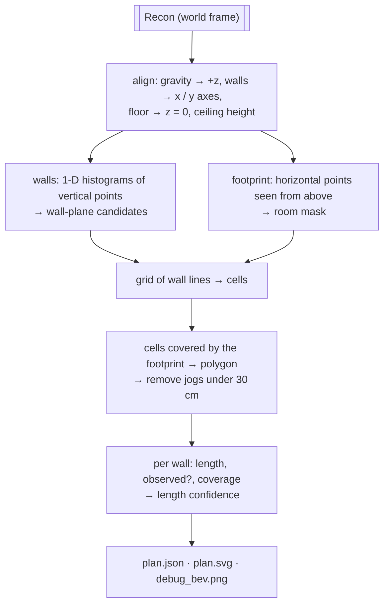

### 5.1 Align: `fp check align`
1. **Up:** rotate so gravity (ARKit's +y) becomes +z.
2. **Wall axes:** histogram the directions of all wall normals (modulo 90°); the peak is the
   room's main wall direction (89.8° here). Rotate so walls run along x and y. This assumes a
   rectangular ("Manhattan") layout.
3. **Floor and ceiling:** stack up-facing and down-facing points by height.
```
 height (schematic)  up-facing area               down-facing area
  2.45 m                                           ██████████  ← ceiling = highest layer ≥ 0.3 m²
  1.4  m                                           ████          cabinet undersides
  0.9  m              ██████  counter tops
  0.0  m              ███     ← floor = LOWEST layer ≥ 0.3 m²
```
Here the floor is smeared from −0.2 to +0.5 m, so "lowest" lands ~0.29 m too low (REVIEW #7).
The fix is to take the *biggest* layer within a plausible distance below the camera.

### 5.2 Wall candidates: `fp check walls`
Take vertical points (normal within ~11° of horizontal) between 0.3 m and ceiling − 0.2 m.
For walls running along y (normal facing ±x), count points by their x position in 1 cm bins.
A wall is a tall, narrow peak.
```
 count of x-facing wall points at each x (1 cm bins)
   │                                                    █
   │                                               █    █
   │                                          █    █    █
   │  ·   ·    ·     ·      ·    ·     ·      █    █    █
   └──────────────────────────────────────────┴────┴────┴──► x (m)
    −1.89 (no peak: open to the living room,  3.14 3.32 3.42
           so that edge will be "inferred")   one smeared wall → 3 candidates (REVIEW #4)
```
- A peak needs at least 0.25 m² of surface behind it.
- Peaks within 10 cm of a stronger one are skipped.
- The final position is the median of points within ±3 cm.
- The same is done along y.

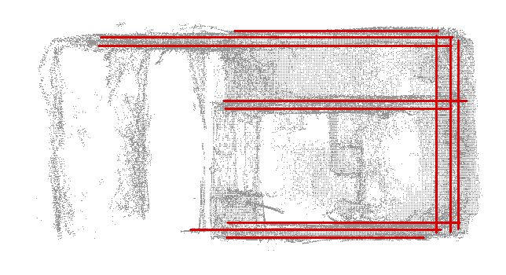

Grey = wall points from above. Lines = candidates (red = spread over 3 cm). This scene has 11
candidates for 4 real walls, all smeared.

### 5.3 Footprint: `fp check footprint`
Every horizontal surface between floor and ceiling is inside the room: floor, counter tops,
bed tops, cabinet undersides, ceiling. Using only the floor would shrink kitchens, where
counters hide it. These points are drawn from above on a 2 cm grid, small gaps (18 cm) are
closed, holes are filled, and the largest blob is kept.

### 5.4 Grid → polygon
```
 1. wall lines (│ ─) + footprint (░)     2. a cell is interior if ≥ 50 % covered   3. union of interior cells
    │      │          │                     │      │          │                     ┌─────────────────┐
  ──┼──────┼──────────┼──                 ──┼──────┼──────────┼──                   │                 │
    │░░░░░░│░░░░░░░░░░│                     │  ✓   │    ✓     │                     │                 │
  ──┼──────┼──────────┼──                 ──┼──────┼──────────┼──                   │      ┌──────────┘
    │░░░░░░│   ░      │                     │  ✓   │          │                     │      │
  ──┼──────┼──────────┼──                 ──┼──────┼──────────┼──                   └──────┘
```
- Polygon edges therefore sit **exactly on measured wall planes**, not on the fuzzy outline of
  the mask.
- Where no wall was seen, the footprint's edge is used instead; that wall is drawn dashed as
  *inferred*.
- Clean-up removes features narrower than 30 cm, and merges short steps between two parallel
  candidates onto the one with more wall evidence:
```
 before:  ──────────┐                      after:  ─────────────────────
                    └──────────   (10 cm step)
```
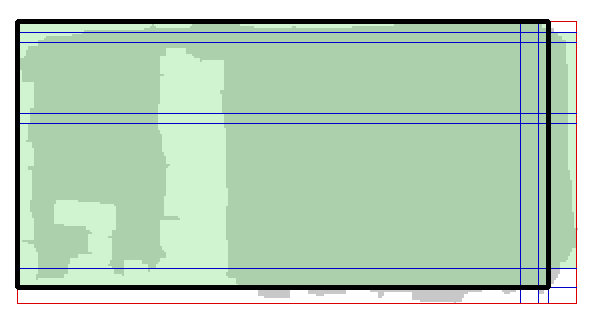

Grey = footprint; blue = wall lines; red = fallback lines (no wall seen); green = interior
cells; black = final polygon. This scene: 5 × 8 grid lines, 22 interior cells → 4 walls,
14.13 m². The polygon also covers the living-room glimpse on the left (multi-room splitting
comes in checkpoint 4).

### 5.5 Dimensions and confidence
A wall's **length** is the distance between the two walls at its ends. So its confidence
depends on how well **those two neighbours** were observed:
```
 length confidence = source prior × (0.3 + 0.7 × min(coverage of the two neighbouring walls))
 coverage          = fraction of 5 cm slots along a wall that contain wall points
 source prior      = 0.9 LiDAR · 0.65 video · 0.5 photos   (placeholders until calibrated by eval)
```
| Wall | Axis | Length | Wall itself observed? | Coverage | Confidence | Why |
|---|---|---|---|---|---|---|
| W1 | x = −1.89 | 2.661 m | no (open end) | 0.00 | 0.64 | ends are W2, W4: 0.9 × (0.3 + 0.7 × 0.59) |
| W2 | y = −1.78 | 5.310 m | yes | 0.59 | 0.27 | one end is W1, never seen: 0.9 × 0.3 |
| W3 | x = 3.42 | 2.661 m | yes | 0.98 | 0.64 | ends are W2, W4 |
| W4 | y = 0.88 | 5.310 m | yes | 0.66 | 0.27 | one end is W1 |

Known gap: confidence ignores smear. A wall spread over 6 cm still scores high (REVIEW #2).

### 5.6 Outputs: `fp run <capture>` → `out/<capture>/`
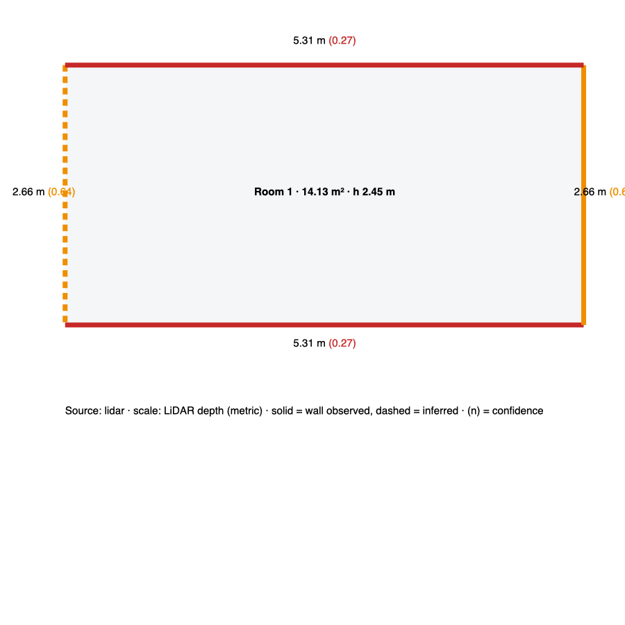

- **plan.svg:** solid = observed wall, dashed = inferred; (n) = length confidence;
  green ≥ 0.7, amber ≥ 0.45, red below.
- **plan.json:**
```json
{
 "schema": "fp.plan/0.1",
 "source": {"input": "lidar", "scale": "LiDAR depth (metric)", "n_frames": 824},
 "rooms": [{
   "polygon": [[x, y], ...],
   "walls": [{"id": "W2", "axis": "y", "coord": -1.7822, "length_m": 5.31,
              "observed": true, "coverage": 0.59, "confidence": 0.27}],
   "area_m2": 14.13, "extent_x_m": 5.31, "extent_y_m": 2.661, "ceiling_h_m": 2.452
 }],
 "connections": [], "damage": [],
 "T_plan_world": "4x4 matrix"
}
```
- **debug_bev.png:** the plan drawn over the points.
- **points_plan.npy:** the cloud in the plan frame.

---

## 6. Accuracy against laser ground truth: `eval/arkit_gt.py`
ARKitScenes also provides `highres_depth`: depth maps rendered from a **Faro laser scan** of
the same room.
1. Build a ground-truth cloud with the *same* back-projection (§4.3), using every 10th
   laser depth map, every 4th pixel and 1 cm voxels.
2. For each of our walls, find the laser wall position (median within ±15 cm).
3. Recompute each length from the laser positions and compare.

This scene: the room width is **2.661 m vs laser 2.509 m (+15.2 cm)**. The long walls end at
the open side, so there's no laser plane to compare against. Ceiling height can't be checked
because the laser depth stops around 1.8 m.

Caveat: searching only ±15 cm around *our* wall hides bigger errors (REVIEW #3).

## 7. Component checklist

| Stage | Command | Look at | Healthy | This scene |
|---|---|---|---|---|
| Frames | `fp check frames` | `frames_sheet.png`, `frames_worst.png` | < 10 % blurry | 21 % blurry ✗ |
| Poses | `fp check poses` | `poses_topdown.png` | rotation p95 < 40°/s, no gaps | 102°/s ✗ |
| Fusion | `fp check fusion` | `fusion_1…5` | wall slice one thin line; oblique normals < 25 % | streaks, 53 % ✗ |
| Cloud | `fp check cloud` + `view` | `cloud.ply` | thin walls, flat floor | fuzzy |
| Align | `fp check align` | printed layers | one sharp floor layer; ≥ 95 % floor normals up | floor smeared, ~0.29 m off ✗ |
| Walls | `fp check walls` | `walls.png` | one line per wall, spread ≤ 2 cm | 11 lines, all smeared ✗ |
| Footprint | `fp check footprint` | `footprint.png` | black outline hugs the walls | includes the living-room glimpse |
| Plan | `fp run` | `plan.svg` | lengths match tape within a few cm | width +15 cm ✗ |
| vs laser | `eval/arkit_gt.py` | printed table | MAE ≤ 3 cm | 15.2 cm ✗ |

Work top to bottom: a failure early on (blurry frames, fast pans) breaks everything after it.
[TESTING.md](TESTING.md) has more detail per stage.

## 8. Where things stand
The pipeline runs end to end in about 6 seconds per room. The weak link is the **3D cloud
itself**: every surface is smeared by ~5–8 cm. That causes duplicate wall candidates, a
wrongly placed floor, noisy normals and a +15 cm width error, while confidence stays high.

Next steps, in order:
1. Frame-quality filter (REVIEW #1).
2. Depth↔pose time-offset experiment (REVIEW #17).
3. Floor picked by largest layer near the camera height (REVIEW #7).
4. Smear-aware confidence (REVIEW #2).
5. Re-run on your real captures.
