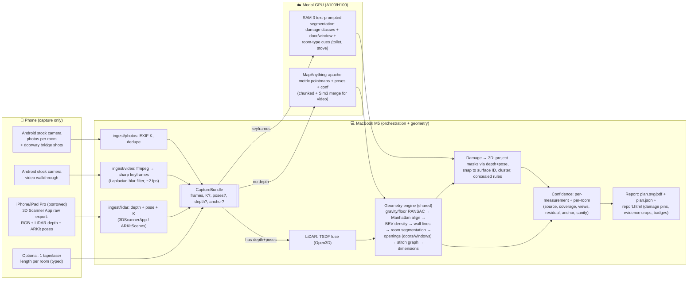

# PLAN — Phone capture → dimensioned floor plan + damage

_Inputs: Android phones (iQOO Neo 10, Redmi Note 10 Pro Max), no iPhone/LiDAR device (maybe borrowable), no printer, laser meter + Magicplan for eval, 48h over 2 days._


## 0. One-paragraph pitch
All three inputs go through **one canonical `CaptureBundle`** (frames + optional intrinsics/poses/depth + optional scale anchor) and then **one shared geometry engine**. The output is therefore identical in schema regardless of input. Only the **confidence** changes, and it is computed from what actually went in.
- Photos and video use **MapAnything** (Apache-2.0, metric feed-forward multi-view reconstruction) on Modal.
- LiDAR uses raw depth + poses (ARKitScenes / 3D Scanner App export), fused on the Mac.
- Floor plan, stitching, damage and the report are shared by all three paths.

## 1. Requirements checklist

| Brief bullet | How we satisfy it | How we prove it |
|---|---|---|
| Own pipeline phone→output; capture via app **or clear non-engineer protocol** | `CAPTURE_PROTOCOL.md`: a one-page protocol for the stock camera app (photo pattern, video walk path, doorway "bridge" shots, lighting, optional one tape length). We own everything from the raw files onward: frame selection, reconstruction, geometry, damage, confidence, report. | A non-engineer (family member) captures one full run uncoached. That run is included in the eval table. |
| 3 inputs → same output, honest confidence | Adapters `photos/`, `video/`, `lidar/` → `CaptureBundle` → same engine → same `plan.json` schema. Confidence = f(source, coverage, views, consistency, anchor). | (a) Schema diff test: all three outputs validate against one JSON schema. (b) **Data ablation**: 4 / 8 / 16 photos → video → LiDAR on the same room. Confidence must rise and error must fall; we report Spearman(confidence, \|error\|). |
| Stitched whole-property plan: rooms placed, connected, dimensioned | Joint reconstruction across rooms (photos jointly; video in chunks with Sim(3) merge on overlapping frames). Doorway bridge shots tie rooms together. BEV → walls → room segmentation → door graph → dimensioned SVG/PDF. | Cross-room laser lines (through aligned doorways) vs the stitched plan. Room adjacency graph matches reality. Side-by-side with Magicplan's plan. |
| Surface damage + likely concealed damage, tied to surfaces | Open-vocab segmentation (SAM 3 text prompts: crack, water stain, mold, peeling paint, hole), projected via depth+pose onto a specific wall/ceiling/floor ID and clustered. Concealed = **explainable rules** over surface + plan context (e.g. stain on a wall shared with a bathroom → possible plumbing leak). | Hand-catalogued defect list for the test home: recall, precision, and correct-surface assignment rate. Every concealed flag shows the rule that fired plus its evidence crop. |
| Strict accuracy + repeatability vs tape/laser; benchmark consumer app | Pre-registered targets (§5). Laser GT ×3 per measurement. 3 repeat captures per input. Magicplan ×2. | Results table: us (per input) vs Magicplan vs laser. MAE, MAPE, max error, repeat SD. |
| Find weakest result, root-cause, ship a measurable fix | After the baseline eval, rank metrics by gap-to-target. Diagnose using per-stage debug artifacts (BEV images, residuals). Fix it, then re-run on a **held-out** capture. | Before/after row in the results table. The fix is diagnosed on runs 1–2 and verified on run 3 plus the cold room. |
| Runs cold on an unseen space | Single CLI `fp run <capture_dir>`: no per-scene tuning, fixed thresholds, auto-detects input type. | Rehearsal on a neighbour's/friend's flat with zero code changes. |

## 2. Architecture



## 3. Scope

| Item | Status | Reason |
|---|---|---|
| Capture protocol (non-engineer one-pager) | **BUILD** | The brief allows a protocol instead of an app; no iPhone, and an Android app would cost 6–10h. |
| `CaptureBundle` + 3 ingest adapters | **BUILD** | This is what "same output" means architecturally. |
| MapAnything recon on Modal (photos, video) | **BUILD** | Metric scale without markers; Apache-2.0; accepts optional poses/depth. |
| LiDAR fusion + plan | **BUILD**, validated on ARKitScenes | No LiDAR device. Own-device validation happens **only if borrowed**. The report shows "LiDAR path validated on public data (n rooms)" when it hasn't been. |
| Geometry engine (walls, rooms, doors, windows, dims) | **BUILD** | Core deliverable; heuristic and explainable. |
| Whole-property stitching | **BUILD** (joint recon + doorway bridges); manual-nudge fallback **STUB** | Must-have. Global loop closure is out of scope; if stitch residual > threshold the room is drawn but flagged "placement low confidence". |
| Scale: learned metric + optional single typed length | **BUILD** | No printer. The anchor length is **excluded from eval metrics**. |
| A4-sheet / ArUco auto scale | **SKIP** | No printer; white paper on white Indian vitrified tiles is unreliable. |
| Surface damage (SAM 3 zero-shot) | **BUILD** | Generalises to an unseen space better than a BD3 fine-tune trained on outdoor walls. |
| Fine-tuned damage detector (YOLO on BD3/Crack-Seg) | **STUB** (fallback only) | Only used if the weakest result is damage precision. |
| Concealed damage | **BUILD as rules, labelled "hypothesis"** | No dataset supports concealed-damage ML; claiming it would be theatre. |
| Concealed-damage ML / severity grading / cost estimate | **SKIP** | No ground truth. |
| Furniture / object detection in plan | **SKIP** | Not in the brief. |
| Custom iOS / Android app | **SKIP** | No iPhone. Android app gives better VIO scale but costs a third of the time budget. |
| Web viewer / editing UI | **SKIP** | Static HTML report is enough to defend. |
| Calibrated ±cm error bands | **BUILD after eval** | Bands come from *our measured* error per confidence bin, never invented. |

## 4. Hour-by-hour plan (≈34 work hours + 2 sleep blocks)

| Hours | Work | Checkpoint (must be true to move on) |
|---|---|---|
| H0–1.5 | `uv` env, Modal auth + hello-GPU, download 3–5 ARKitScenes validation scenes (with Faro GT), request SAM 3 gated weights, pull MapAnything-apache, define `CaptureBundle` + `plan.json` schema | **CP0**: Modal GPU call works; one ARKitScenes scene loads |
| H1.5–6 | LiDAR one-room path: ingest → TSDF → floor RANSAC/gravity → BEV → RANSAC wall lines → Manhattan snap → polygon → dims → ugly SVG + JSON + stub damage/confidence | **CP1 (ugly E2E, 1 room, LiDAR)**: `fp run scene/` outputs a dimensioned SVG; wall lengths printed against Faro-mesh GT |
| H6–9 | **Field session** (laptop idle): write protocol v1, laser GT of 3–4 rooms + hallway (×3 each), cross-room lines, defect catalogue, run 1 of photos + video, Magicplan scan ×2 | **CP2**: `eval/ground_truth.yaml` filled; raw captures on disk |
| H9–14 | Modal MapAnything service (photos joint; video keyframes) → same geometry engine; per-room error printout | **CP3**: same `plan.json` from photos and video for one room; first MAPE numbers |
| H14–15 | Scale anchor input + door-height sanity check; confidence v1 | Anchor rescale works; badges on every dim |
| H15–21 | Sleep (field run 2 captures in the morning ≈ 30 min) | — |
| H21–26 | Whole property: video chunking + Sim(3) merge, photo joint recon with bridge shots, room segmentation (watershed on BEV free space), door graph, stitched SVG | **CP4**: stitched, connected, dimensioned plan of the whole home from video **and** photos |
| H26–30 | Damage: SAM 3 on keyframes → project → snap to surface → cluster; room type from cues; concealed rules | **CP5**: damage pins on the correct walls in report |
| H30–32 | `report.html`: plan + pins + evidence crops + confidence + "how measured" footer; LiDAR-validation disclaimer | Report readable by a non-engineer |
| H32–35 | Full eval: 3 runs × {photos, video} + LiDAR (ARKitScenes; borrowed device if available) + Magicplan + data ablation; fill tables | **CP6**: baseline results table complete, targets marked pass/fail |
| H35–39 | Weakest result: rank by gap-to-target → diagnose with stage artifacts → fix → re-run on held-out run 3 + ablation | **CP7**: before/after row with measured improvement |
| H39–44 | Sleep | — |
| H44–47 | **Cold-run rehearsal** on an unseen flat (zero code changes), protocol followed by the non-engineer; finalise DECISIONS.md with real numbers; demo script | **CP8**: cold output produced; failures logged, not hidden |
| H47–48 | Freeze, tag release | — |

Cut order if behind: (1) borrowed-LiDAR validation, (2) window detection, (3) room-type cues → user typed labels, (4) photos-path stitching (keep video stitching).

## 5. Evaluation plan

**Ground truth (laser, each reading ×3 → mean ± SD):**
- Per room:
  - **Length and width**: two readings each, ~30 cm from each end wall; the reported value is the mean.
  - **Every wall segment**: corner to corner at ~1 m height.
  - **Ceiling height**: at the room centre.
  - **Each door**: clear width and height.
  - **Each window**: width and sill height.
- Property: **2 cross-room lines** through aligned doorways (tests stitching), plus total extent along the longest axis.
- Damage: a walk-through catalogue of every visible defect, with photo, room, surface, type and approximate position. Done **before** looking at model output.
- LiDAR: ARKitScenes Faro-scanner meshes. Dims are measured on the GT mesh using the same definitions as above. Several sequences of the same venue give repeatability.

**Captures:**
- Photos ×3 runs and video ×3 runs, all whole-property, by the builder.
- 1 run of each by a **non-engineer** following the protocol.
- Magicplan Android AR ×2.
- LiDAR: 5 ARKitScenes rooms, plus 2 borrowed-device runs if possible.
- Ablation on one room: 4 / 8 / 16 photos, 30 s video, full video, LiDAR (ARKitScenes room).

**Metrics:**
- MAE (cm), MAPE (%), max abs error (cm), repeatability SD (cm) across runs.
- Wall/door/window recall and precision.
- Stitch: cross-room line error (cm) and adjacency-graph correctness.
- Damage: recall vs catalogue, precision of flags, correct-surface rate.
- Confidence honesty: Spearman ρ(confidence, |error|), plus an ablation curve that should be monotone.

**Pre-registered targets** (set before measuring; pass/fail reported honestly):

| Input | Room dims MAPE | Max err | Repeat SD | Doors width MAE |
|---|---|---|---|---|
| LiDAR | ≤ 1.5 % | ≤ 6 cm | ≤ 2 cm | ≤ 4 cm |
| Video (+1 typed anchor) | ≤ 3 % (≤ 2 %) | ≤ 15 cm | ≤ 2 % | ≤ 8 cm |
| Photos (+1 typed anchor) | ≤ 5 % (≤ 3 %) | ≤ 20 cm | ≤ 3 % | ≤ 10 cm |
| Stitch | cross-room line ≤ 3 % | — | — | adjacency 100 % |
| Damage | recall ≥ 70 %, precision ≥ 60 %, correct surface ≥ 80 % | | | |

**Results table format** (cell = mean of runs (SD), error vs GT in brackets):

| Room | Measure | Laser GT | Photos | Photos+anchor | Video | Video+anchor | LiDAR | Magicplan |
|---|---|---|---|---|---|---|---|---|
| Bedroom 1 | Length | 3.412 ± 0.002 | 3.51 (0.04) [+2.9 %] | … | … | … | … | … |

Summary table: one row per input type with MAE, MAPE, max, repeat SD, recall columns, ρ, and target pass/fail. Plus one **before/after-fix** row.

## 6. Risks + fallbacks

| Risk | Fallback |
|---|---|
| MapAnything metric scale is off by 5–10 % indoors | Typed single anchor (excluded from metrics); door-height sanity flag lowers confidence; report "approx." badge |
| Memory/time blowup on long video (100s of frames) | Keyframe cap per chunk + overlapping chunks + Sim(3) merge; A100-80GB/H100; MLX port exists for small local tests |
| White walls / glare on vitrified tiles → noisy BEV | MapAnything conf masking; RANSAC with strong Manhattan prior; low-coverage walls drawn dashed + Low badge instead of invented |
| Rooms don't stitch (missing bridge views, drift) | Protocol requires 2 bridge shots per doorway; if residual is high, place via doorway match and flag "placement low confidence"; last resort manual offset in JSON, labelled |
| SAM 3 gated weights delayed / weak on cracks | Grounding-DINO + SAM 2 (Apache); then BD3/Crack-Seg YOLO fine-tune on Modal (≈1–2 h) |
| No LiDAR device ever | LiDAR path evaluated on ARKitScenes only, stated in report and README; cold-run LiDAR = "supported, validated on public data" |
| ARKitScenes GT ≠ tape (mesh-derived) | Measure GT dims on the Faro mesh with the same definitions; state the method |
| Magicplan Android free tier limits export | Read dims from in-app screens/screenshots; note it |
| Claude Pro usage runs out | Compact Python, reuse Open3D/shapely/ffmpeg; no UI framework; debug with stage artifacts, not long chats |
| Overfitting the fix to the test home | Diagnose on runs 1–2, verify on run 3 + the cold flat |
| Cold space has mirrors / glass / clutter | Protocol tells the user what to do (open curtains, avoid mirrors); mirror-like walls get low confidence; failure listed in report |

## 7. Repo layout (to be created after "go")
```
floorplan/
  PLAN.md  DECISIONS.md  CAPTURE_PROTOCOL.md  README.md
  fp/ingest/{photos,video,lidar}.py  fp/bundle.py
  fp/recon/{modal_app.py,lidar_fuse.py}
  fp/geometry/{gravity,bev,walls,rooms,openings,stitch,dims}.py
  fp/damage/{detect_modal.py,project.py,rules.py}
  fp/confidence.py  fp/report/{svg.py,html.py}  fp/cli.py
  eval/{ground_truth.yaml,run_eval.py,results.md}
  data/  (gitignored)
```


