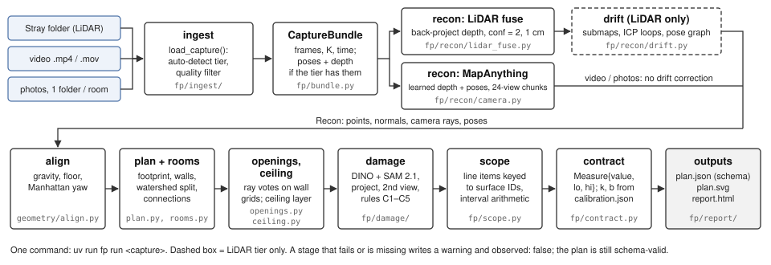
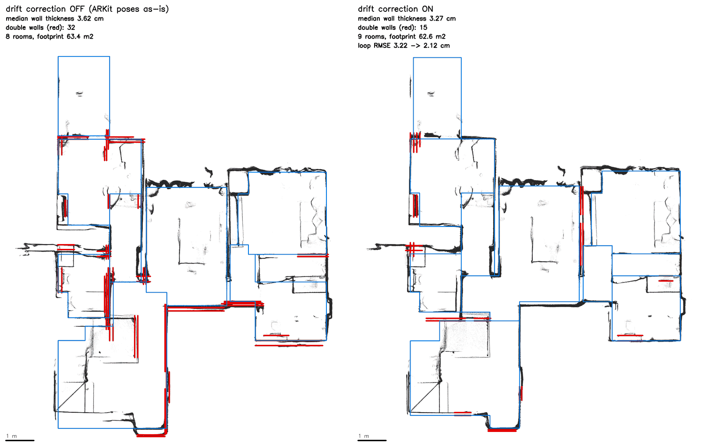
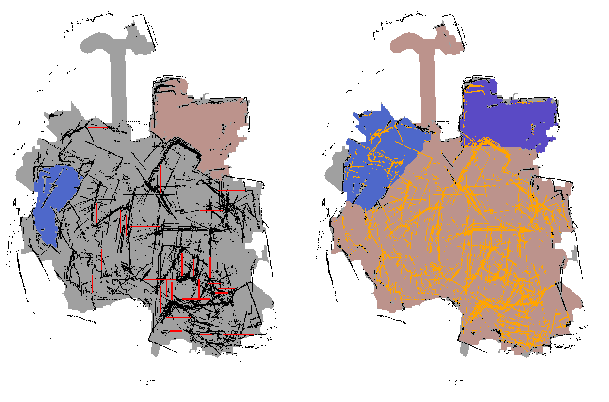

# Floorplan: technical report

Phone capture → dimensioned, stitched floor plan. Repo `floorplan`, 8 Oct 2026. Every number links to the file that
holds it (mostly `eval/`, regenerated by `make benchmark`).

## 1. Summary

- **What runs.** One command, `uv run fp run <capture>`, takes a Stray Scanner LiDAR folder, a video, or per-room photo
  folders. It writes one schema-valid `plan.json` with a 90 % interval on every number, plus `plan.svg` and `report.html`. All
  of it runs on a laptop (CPU/MPS). The benchmark ran all 7 sample plans in [962 s](../eval/BENCHMARK.md).
- **What passes.** [3 of 27 gates](../eval/BENCHMARK.md): the drift ablation on both whole-flat scans, and video interval
  calibration. That last pass comes from wider intervals, not better accuracy (§6).
- **What fails.** [13 gates](../eval/BENCHMARK.md). LiDAR repeatability is about ±5 cm, not 1 cm. Openings are 50 % right by
  eye. Camera-tier walls are 37–39 % off at the median, and the photo stitch loses 70–79 % of the floor.
- **What isn't scored.** [10 gates are NOT SCORED and 1 is NOT DONE](../eval/BENCHMARK.md). The evaluator's sample data has no
  tape, and my own captures (video, photos, tape, app export) are still pending. Until then the stand-in for truth is the
  LiDAR plan, which is a reference and not ground truth.

## 2. Architecture

- **Ingest** (`fp/ingest/`). `load_capture` detects the tier from the folder. Stray (it has `depth/` and `odometry.csv`) is
  checked before photos, so depth maps are never read as photos. Poses come from `odometry.csv`, using the OpenCV camera
  convention and odometry timestamps (never i/60). Photos: HEIC, EXIF rotation, P3 → sRGB, and a focal-length prior from EXIF.
  Video: bundled ffmpeg, HDR tone-mapping, the rotation tag, 3 fps, at most 240 keyframes. A quality filter drops blurred
  frames, fast turns (> 40°/s) and duplicates.
- **Recon, LiDAR** (`fp/recon/lidar_fuse.py`). Depth is back-projected with the ARKit poses, keeping only confidence 2,
  depth within 4 m, and a 1 cm voxel grid. I chose these settings by measured wall thickness (D8).
- **Recon, camera tiers** (`fp/recon/camera.py`). MapAnything runs locally and predicts metric depth, intrinsics and poses.
  Video runs in 24-view chunks with 6 views of overlap. Chunks are merged by the median depth ratio at shared pixels, and the
  scale is the median of the chunks' votes. Photos go through one joint pass, so all rooms share one frame. Scale priors
  (camera height, ceiling height) widen the intervals but never rescale the plan. Raw model outputs are cached by input-byte
  hash, so a replay gives an identical plan and a new capture always runs live.
- **Drift** (`fp/recon/drift.py`, LiDAR only). Pose graph over submaps (§4).
- **Align** (`fp/geometry/align.py`). Gravity comes from the sensor, or from image-up on camera tiers. The floor is the largest
  up-facing layer below the camera. Yaw is the peak of the wall-normal angle histogram (mod 90°).
- **Plan and rooms** (`fp/geometry/plan.py`, `rooms.py`). The footprint is the union of horizontal surfaces, cells crossed by
  camera→point rays from ≥ 3 frames, and a 0.3 m band around the camera path. Tall wall evidence is cut out, and 0.5–1.3 m
  gaps on a wall line are barred as doorways. A watershed then splits rooms. Each room becomes a rectilinear polygon whose
  edges sit on fitted wall planes.
- **Openings and ceiling** (`openings.py`, `ceiling.py`). On each wall elevation, depth rays vote "wall", "seen through" or
  "unobserved". Doors, windows and passages are classified by sill and lintel height, and width is measured between the jamb
  planes. A mirror test and a recess test reject false openings. The ceiling is the largest down-facing layer 2.1–3.6 m above
  each room's own floor. If none is found, it is reported as not observed.
- **Damage** (`fp/damage/`). Grounding DINO plus SAM 2.1 find candidates. Each mask is projected onto its wall, floor or
  ceiling plane for a metric extent. A detection counts only if a second view ≥ 25 cm away confirms it. Rules C1–C5 raise
  concealed-damage flags, labelled as hypotheses.
- **Scope** (`fp/scope.py`) turns each surface into line items (repaint, patch, skirting), using interval arithmetic.
  **Contract** (`fp/contract.py`) turns every value into `Measure{value, lo, hi, unit, method, observed}`, with the fitted
  constants from `fp/calibration.json`. Damage, openings and scope refer to surfaces by stable IDs (`R1.W2`), and the schema
  rejects any reference that doesn't exist.

## 3. Tier design and device matrix

All three tiers use one schema and one CLI. Only `tier` and the interval width change. Before calibration, the evidence term
is scaled ×1 / ×3 / ×6 for LiDAR / video / photos (`fp/contract.py`). The fitted constants then widen it further
([CALIBRATION](../eval/CALIBRATION.md)). The full matrix is in [DEVICE_MATRIX.md](DEVICE_MATRIX.md).

| tier | capture | phone | depth + poses from | laptop run (M5, MPS) | wall-length error today | stated interval |
|---|---|---|---|---|---|---|
| LiDAR | Stray Scanner walk | Pro iPhone / iPad with LiDAR | sensor + ARKit, drift-corrected | c7d2 flat [233 s](../eval/BENCHMARK.md) | repeat spans median [5.5 cm](../eval/repeatability_lidar.md) | k = [1.42](../eval/CALIBRATION.md) × evidence |
| video | handheld walkthrough | any iPhone 15+ | MapAnything (learned) | c7d2 [511 s live](../eval/BENCHMARK.md) | median [37–39 %](../eval/BENCHMARK.md) vs LiDAR | ±[409 %](../eval/CALIBRATION.md) of a wall |
| photos | 2–8 per room, one folder per room | any iPhone 15+ | MapAnything, one joint pass | 17 photos, one pass | median [15–22 %](../eval/BENCHMARK.md) vs LiDAR | ±[312 %](../eval/CALIBRATION.md) of a wall |

The camera-tier inputs are derived from the Stray captures: the video and stills are cut from `rgb.mp4`, with the rotation tag
and EXIF focal length a phone would write (`scripts/make_camera_tiers.py`). The protocol tells users that video is the
stronger camera tier.

## 4. Drift handling

**Method (D12).** ARKit's gravity and frame-to-frame motion are good. Heading and position drift over a multi-minute walk.
I cut the walk into rigid submaps (every 3 m or 8 s). Where the camera revisits a place, I align the two submaps with
point-to-plane ICP. A loop is accepted only if the fit is ≥ 20 %, the RMSE is ≤ 1.5 cm, the geometry pins all three directions
(a bare corridor can slide, so it is rejected), the correction is plausible, and it tilts ≤ 1°. An Open3D pose graph with a
line process then prunes inconsistent loops and solves for one correction per submap. I apply yaw and translation only,
because gravity stays ARKit's. Corrections are blended in time between submap centres. The flag `--no-drift-correction`
turns it off for the ablation.

<em class="cap">Figure: c7d28f72c6, drift off (left) and on (right). Red marks double walls. Source: `out/c7d28f72c6/debug/drift_ablation.png`; the same figure for 1a8384c3f6 is in `docs/img/drift_ablation_1a83.png`.</em>

| capture | wall thickness off → on | double walls off → on | loop RMSE off → on | loops accepted | footprint off → on |
|---|---|---|---|---|---|
| 1a8384c3f6 (115 s, no ceiling) | [4.2 → 1.9 cm](../eval/BENCHMARK.md) | [13 → 7](img/drift_ablation_1a83.png) | [3.34 → 1.83 cm](../eval/repeatability_lidar.md) | [8 / 25](../eval/BENCHMARK.md) | [55.31 → 57.05 m²](../eval/BENCHMARK.md) |
| c7d28f72c6 (215 s, revisits) | [3.6 → 3.3 cm](../eval/BENCHMARK.md) | [32 → 15](img/drift_ablation_c7d2.png) | [3.22 → 2.12 cm](../eval/repeatability_lidar.md) | [17 / 138](../eval/BENCHMARK.md) | [63.43 → 62.64 m²](../eval/BENCHMARK.md) |

(The double-wall counts are printed on the ablation figures, from `plan.drift.metrics`. They are not in `eval/`.)

**What it costs, and what it can't fix.** With drift correction **off**, the two scans' wall-to-wall spans agree better
(median [1.9 cm vs 5.5 cm](../eval/repeatability_lidar.md)). But fewer walls register ([55 % vs 69 %](../eval/repeatability_lidar.md))
and room edges agree 3× worse (40 cm vs 12 cm). Each correction is only good to about the residual loop RMSE (~2 cm), and
that error ends up inside the rooms. So correction trades a few cm of local accuracy for global consistency. Drift larger
than the plausibility test allows is rejected, not corrected. In a verifier test, 10° of yaw injected into half of 1a83 was
mostly left in place. The plan now warns when correction widens the heading spread across submaps by more than 0.5°. The
camera tiers get no drift correction at all, which is the root of §7.

## 5. Error budget

Wall lengths, areas and ceilings use the interval model from §6. The table lists the main error sources I can measure,
per tier. "vs LiDAR" means against the LiDAR plan of the same capture, not tape.

| measurement | LiDAR | video | photos |
|---|---|---|---|
| **wall length** | Plane fit ~1 cm + wall smear (median thickness after drift [1.9–3.3 cm](../eval/BENCHMARK.md)). Drift-correction residual: repeat spans median [5.5 cm, p90 11.8 cm](../eval/repeatability_lidar.md). Room split at a different doorway: per-wall edges median [12.5 cm](../eval/repeatability_lidar.md). | Camera poses: video path vs LiDAR Sim(3) scale [0.48, residual 2.4 m](../fixloop/RESULT.md); chunk merges disagree by [0.3–1.5 m](../fixloop/RESULT.md). Result: median [37–39 %, p90 71–76 %](../eval/BENCHMARK.md). | Too few photos overlap. Median [15–22 %, p90 24–62 %](../eval/BENCHMARK.md) on 3–9 matched walls. |
| **floor area** | Segmentation dominates: matched rooms differ by [0.5–2.6 m²](../eval/repeatability_lidar.md) between scans, while their wall planes sit a median 3.8 cm apart. | Rooms merge (no doorway necks). Footprint [+19 % / +22 %](../eval/BENCHMARK.md). | Rays from ≥ 3 frames are rare with few photos, so rooms come out undersized: [−70 % / −79 %](../eval/BENCHMARK.md). |
| **ceiling** | Layer spread / √patches + 1 cm, + 3 cm if the room's floor wasn't seen. Never compared with tape. Not observed on 1a83 and c00a, [as required](../eval/BENCHMARK.md). | One room scored: [2.74 vs 2.47 m (+11 %)](../eval/benchmark.json). | One room scored: [2.47 vs 2.45 m (+0.9 %)](../eval/benchmark.json). |
| **opening width** | Jamb σ + 1 cm per jamb (+2 cm when a wall end stands in for a jamb). Widths not taped. Detection is the bigger error: [7/14 right by eye](../eval/BENCHMARK.md). | Not evaluated. | Not evaluated (too few frames per cell). |
| **damage extent** | Mask coverage × pixel footprint on the plane. Interval 20 % + the tier's scale term. Painted stain [+11 %](STATUS.md). | Same method on model depth; not evaluated. | Same; not evaluated. |

The ceiling, opening and damage intervals are provisional, because there is no evidence to fit them
([CALIBRATION](../eval/CALIBRATION.md)). On c7d2 LiDAR the ceiling half-widths are ±1.2–4.2 cm and the door half-widths
±5–12 cm (`out/c7d28f72c6/plan.json`; not in `eval/`).

## 6. Calibration analysis

**Model** (`fp/calibration.py`, D07.1). Every Measure uses `half = k·a + b·value`. Here `a` is the measurement's own
evidence: the plane fit plus the measured wall smear, ×3 for a wall never seen. `b·value` is a relative (scale) term.
LiDAR fits k with b = 0, because its scale is metric. The camera tiers fit b with k = 1, because their error is scale and shape.
The fit is split conformal: each evidence row gives the factor its interval would have needed, and the constant is the
⌈(n+1)·0.9⌉-th smallest. If n < 9, I take the largest (flagged). Without tape, a constant may widen an interval but never
narrow it.

**Evidence and held-out coverage** ([CALIBRATION](../eval/CALIBRATION.md)). Each fit is checked 2-fold: fit on one half, then
count how often the other half's reference falls inside the interval.

| tier | evidence (stand-in for tape) | fitted | held-out coverage of stated 90 % | gate |
|---|---|---|---|---|
| LiDAR | 16 wall-to-wall spans, repeat scans; whole disagreement charged to each scan | k = [1.42](../eval/CALIBRATION.md) | [62 % / 100 % → 81 % of 16](../eval/CALIBRATION.md) | FAIL |
| video | 12 walls vs the LiDAR plan, folds by capture | b = [4.09](../eval/CALIBRATION.md) | [100 % / 86 % → 92 % of 12](../eval/BENCHMARK.md) | PASS |
| photos | 12 walls vs the LiDAR plan, folds by capture | b = [3.12](../eval/CALIBRATION.md) | [100 % / 56 % → 67 % of 12](../eval/BENCHMARK.md) | FAIL |

**Where it is optimistic.**

- LiDAR spans include only wall planes the two scans matched within 10 cm, so a larger disagreement never enters the fit.
- Repeatability shows precision only. A bias shared by both scans is invisible without tape.
- On per-wall polygon edges, the LiDAR stress set, coverage is only [61 % of 23](../eval/CALIBRATION.md). The intervals model
  plane error, not a room split at a different doorway.
- Camera constants are fitted on the same two captures the gates score, so in-sample coverage is 100 % by construction.
- Floor areas have n = 4–6, so the "largest of n" rule applies.
- Ceilings, openings and damage are not calibrated.
- n is tiny: one miss moves coverage by 6–8 points.

**Why the video pass is not progress.** The fix loop matched more video walls. The refit then widened the video wall
constant from b = [2.41 to 4.09](../fixloop/RESULT.md), so an interval is now ±409 % of a wall. Held-out coverage rose from
[78 % of 9 to 92 % of 12](../fixloop/RESULT.md) because the intervals say "we don't know" more loudly, not because the
walls got better. This is the honest outcome the brief asks for: wide intervals on thin input, rather than confident garbage.

## 7. Fix loop

**Worst gate** (declared before the fix in [FIX_DECLARATION](../fixloop/FIX_DECLARATION.md)): video wall lengths within ±3 % on
`c7d28f72c6-video`, p90 [105 %](../fixloop/FIX_DECLARATION.md) (35× the threshold), with the footprint at 13.2 vs 62.64 m².

**Root cause.** I replayed `extract_rooms` one step at a time. The footprint was fine (84 m²). The area was lost in the room
split: [78 % of the free floor](../fixloop/FIX_DECLARATION.md) fell into seedless slivers between "tall walls". [82 %](../fixloop/FIX_DECLARATION.md)
of those tall cells were seen through by ≥ 3 frames, so they were misregistered copies of walls standing in air. The whole-flat
wall cut (from §2) assumes a drift-corrected cloud, and the camera tiers have none.

**Fix** (`fp/geometry/plan.py`, `seen_through_walls`). On predicted-depth tiers only, a tall cell that rays from ≥ 3 frames
cross is treated as free space. It reuses the existing `MIN_RAY_HITS` rule, so no new threshold was tuned. The LiDAR tier is
unchanged by construction, so its reference plans stay identical. Rejected alternatives, each tested by changing one thing:
the rule on every tier removed 42–75 % of the real LiDAR walls, and giving seedless floor to the nearest room made p90 142 %.

<em class="cap">Figure: `fixloop/before|after/c7d28f72c6-video/rooms_split.png`. Before (left): a lattice of black "walls" shreds the floor, and only two small rooms are kept. After (right): the lattice is ignored (orange), and the floor forms three rooms.</em>

| number ([RESULT](../fixloop/RESULT.md)) | before | predicted | after |
|---|---|---|---|
| c7d2 video wall p90 \|err\| (the gate) | 105 % | 76 % | **76 %** (FAIL, 25.5×) |
| c7d2 video wall median \|err\| | 75 % | 37 % | 37 % |
| c7d2 video footprint | 13.2 m² (−79 %) | +22 % | 76.47 m² (+22 %), IoU 0.18 → 0.59 |
| c00a video footprint / wall p90 | −12 % / 63 % | +19 % / 71 % | +19 % / 71 % (worse) |
| LiDAR and photo plans | — | unchanged | unchanged |

**Why it fell short.** The fix stops the plan stage from throwing floor away. It cannot repair the geometry it is given. The
video camera path is metres off: Sim(3) scale [0.48, median residual 2.4 m](../fixloop/RESULT.md). Passing ±3 % needs better
camera-tier poses, for example a pose-graph and loop-closure pass like the LiDAR tier's. That means new model passes, which is
out of scope for a plan-stage fix. The fix also has a cost: on camera tiers, a real wall that frames see through (glass, or a
misregistered frame) is removed, and c7d2 video R1 is still a [61 m²](../fixloop/RESULT.md) merged room. **Regenerate:**
`make fix-before` / `make fix-after`. Each checks out its tag in a temporary worktree and reruns the full benchmark (~16 min).

## 8. Known failure modes

- **Mirrors.** The footprint needs rays from ≥ 3 frames, so one reflection can't punch through a wall. For openings, a mirror
  test reflects the points behind a gap back across the wall plane. If ≥ 50 % land on the room's own surfaces, it is a
  mirror. An oblique vanity mirror scores only 0.30 and survives as a **phantom window** ([R5.O1](../eval/BENCHMARK.md)). I did
  not lower the threshold, because real doors score up to 0.38. On camera tiers the model's depth may put a "room" behind a
  mirror. That is untested.
- **Glass.** LiDAR sees through glazing, so the glazed balcony slider is called a passage ([R4.O1, wrong kind](../eval/BENCHMARK.md)).
  On camera tiers, the fix-loop rule removes any wall that ≥ 3 frames see through, so a glass partition merges two rooms. A
  synthetic test confirmed this ([RESULT](../fixloop/RESULT.md)).
- **Wet-look and shiny floors.** Specular floors return little or wrong depth. The confidence-2 filter drops unreliable pixels,
  so the floor goes missing rather than turning into a phantom. The footprint still covers it through the camera-path band and
  rays to the furniture. A reflection that passes the filter could add points below the floor. Not tested: the sample flats
  have no wet floors.
- **Low light.** The quality filter drops blurred frames (sharpness < 30 % of the median) and fast turns. LiDAR depth is
  active, so it should hold up, but ARKit tracking and RGB (damage, openings sheets) degrade. Learned depth on dark, noisy
  frames will be worse. Not tested.
- **Open-plan spaces.** The watershed splits only at a neck, so a room with no doorway or wall at wall-band height stays merged.
  Part of the corridor merges into the open kitchen on both flat scans (STATUS 03). On camera tiers, blurred doorways give one
  big room.
- **Non-Manhattan walls.** `align` picks one dominant yaw, and `plan.py` finds wall lines only along x and y. A diagonal or
  curved wall produces no wall line. Its stretch of the polygon becomes a staircase of *inferred* (dashed) edges, whose
  evidence term is ×3. The plan does not fit a diagonal. Not tested: the sample flats are rectilinear.
- **Openings missed.** Two curtained windows (no see-through rays), a 0.15 m-sill window (no rule below 0.3 m), and a closed
  door seen only above 1.35 m: [4 misses](../eval/BENCHMARK.md).
- **Damage.** A drawn 0.30 m crack was [missed](../eval/BENCHMARK.md). Static shadows and grout lines pass the second-view check,
  because they stay put too. On the sample data, every confirmed item was false or doubtful ([STATUS 06](STATUS.md)).

## 9. Not done

- **Head-to-head** against a consumer app: [NOT DONE](../eval/HEAD_TO_HEAD.md). There is no LiDAR iPhone, and the recruiter
  approved skipping own LiDAR captures. A substitute protocol (camera tiers vs magicplan) is ready.
- **Tape and own captures.** Wall, ceiling and opening widths vs tape, video and photo repeatability, and staged damage are all
  NOT SCORED until `data/own/` and `eval/ground_truth/own.yaml` exist. `make benchmark` picks them up automatically and refits
  the intervals.
